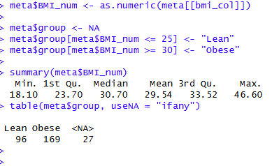

# Obesity-gut-bacterial
Data science project in ML and medical applications

First step - Research question branstorming.
we wanted to explore gut bacteria and it's connection to the obesity / type 2 diabetes..

Our Final Research Question: Which gut bacterial taxa are associated with obesity (BMI ≥ 30 vs BMI ≤ 25), and how well can gut microbiome composition predict obesity status?

Data source - https://waldronlab.io/curatedMetagenomicData/
In order to download the dataset, we will use R notebook since it's the most recommended clean way to download this dataset with no caveats.

In R:
> bmi_col <- grep("bmi", colnames(meta), ignore.case = TRUE, value = TRUE)[1]
> meta$BMI_num <- as.numeric(meta[[bmi_col]])
> 
> meta$group <- NA
> meta$group[meta$BMI_num <= 25] <- "Lean"
> meta$group[meta$BMI_num >= 30] <- "Obese"
> 
> summary(meta2$BMI_num)
   Min. 1st Qu.  Median    Mean 3rd Qu.    Max. 
  18.10   23.50   31.20   29.79   34.00   46.60 
> table(meta2$group)

 Lean Obese 
   96   169 

   We filtered the original dataset to include only lean and obese individuals, removed rare taxa, and applied a log transformation.
   The final analysis was conducted on the processed feature matrix and corresponding metadata.
   
   Explanation:
   We applied a log transformation early because microbiome relative abundance data is highly skewed, sparse, and spans several orders of magnitude, and many of the statistical tests and machine learning models we use later assume more stable variance and benefit from reduced skewness. 
   

   Successfully downloaded the datasets ("LeChatelier_obesity_meta" and "LeChatelier_obesity_X_log").